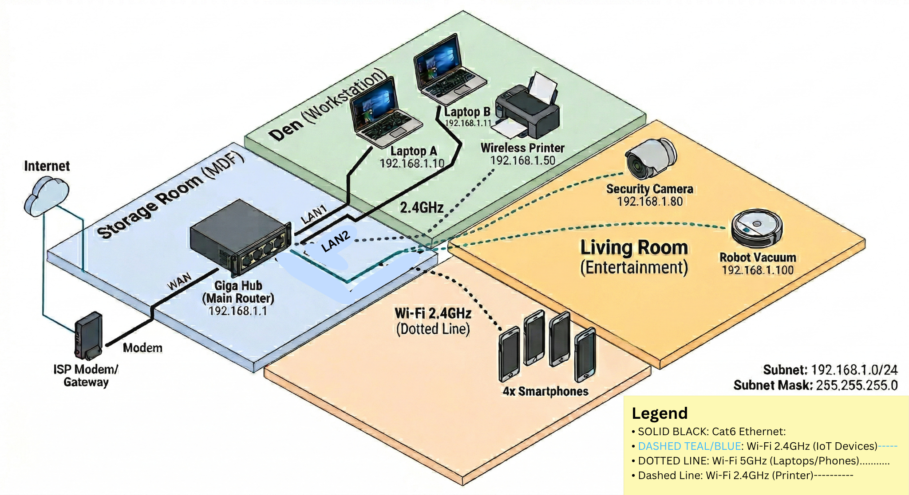

# lesson5
## Network Topologies

### Physical Topology
This diagram illustrates the physical placement of devices in my Winnipeg apartment (Storage, Den, and Living Room) and the Cat6 cabling used for the laptops.

### Logical Topology
This diagram shows the IP addressing schema (192.168.1.0/24) and the logical connection between the ISP gateway and end devices.

