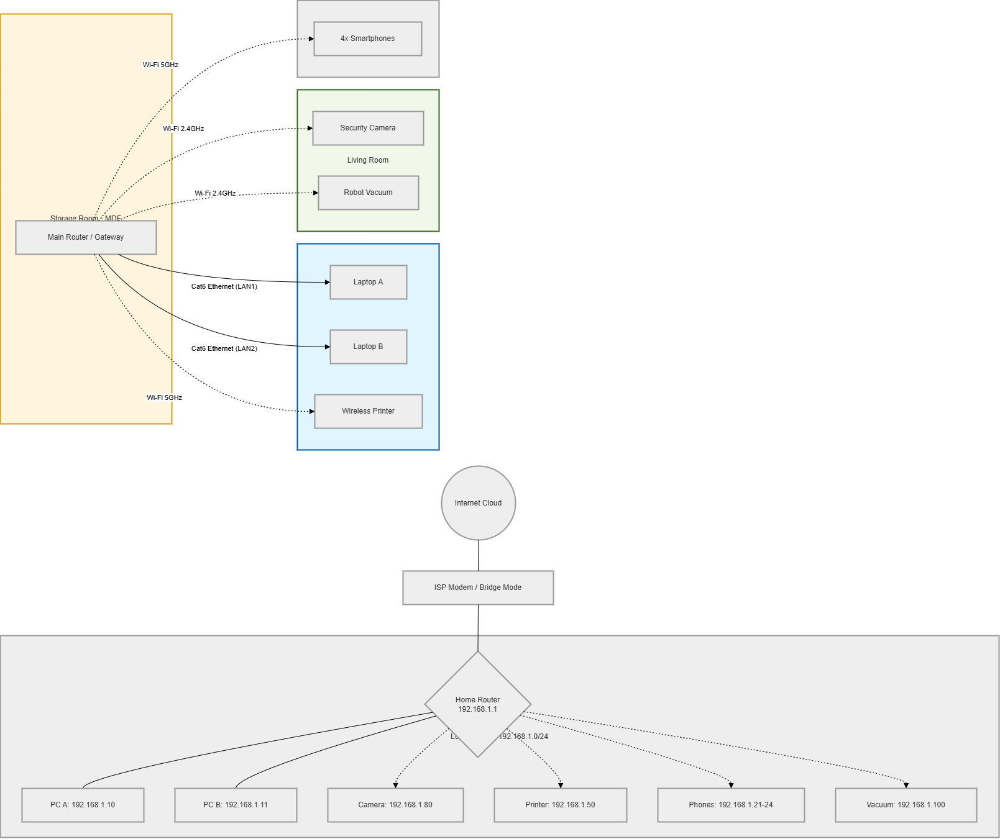

# lesson5
### Home Network Topology
This diagram provides a comprehensive view of my home network in my Winnipeg apartment. It includes the **Physical Topology**, showing the device placement in the Storage Room, Den, and Living Room with Cat6 cabling details, as well as the **Logical Topology**, detailing the IP addressing schema (192.168.1.0/24) and network connectivity.

## 3. Addressing Documentation
*Note: For privacy, MAC addresses are partially masked, and standard private IP ranges are used for this documentation.*

| Device Name | Location | Interface | IP Address | Assignment Type |
| :--- | :--- | :--- | :--- | :--- |
| **Main Router** | Storage Room | WAN / LAN | 192.168.1.1 | Static |
| **Laptop A** | Den | Ethernet (Eth0) | 192.168.1.10 | DHCP Reservation |
| **Laptop B** | Den | Ethernet (Eth0) | 192.168.1.11 | DHCP Reservation |
| **Security Camera**| Living Room | Wi-Fi (2.4GHz) | 192.168.1.80 | Static |
| **Wireless Printer**| Den | Wi-Fi (5GHz) | 192.168.1.50 | DHCP Reservation |
| **Smartphones (x4)**| Mobile | Wi-Fi (5GHz) | 192.168.1.21-24| Dynamic DHCP |
| **Robot Vacuum** | Living Room | Wi-Fi (2.4GHz) | 192.168.1.100| Dynamic DHCP |

## 4. Network Devices and Services
* **Core Gateway**: ISP-provided router acting as the primary DHCP server and Firewall.
* **Security**: IP Camera provides a real-time RTSP stream for home monitoring.
* **Network Storage**: Laptops are configured to share specific folders for local backup over the Ethernet backbone.

## 5. Device Configurations
* **Wireless Security**: WPA2-AES encryption is active on all SSIDs.
* **DHCP Pool**: Configured from `.100` to `.254` for guest and mobile devices.
* **DNS**: Set to Google DNS (`8.8.8.8`) for reliable resolution.

## 6. Secure Credential Management
I use **Bitwarden**, an industry-standard encrypted password manager, to store and manage all administrative credentials for the network devices. 
* **Security Measures**: Access is protected by a strong Master Password and Time-based One-Time Password (TOTP) 2FA.
* **Policy**: No plain-text passwords or sensitive configuration keys are included in this public documentation.
