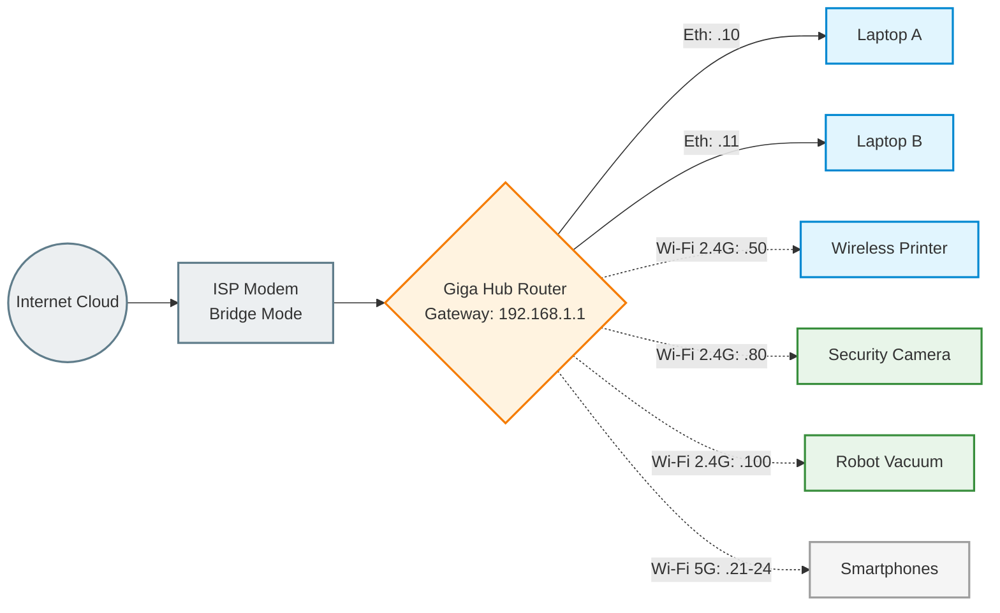

# Lesson 5: Network Documentation

## 1. Physical Topology
This diagram illustrates the physical distribution of network hardware across functional zones within the apartment. 

* **Core Infrastructure:** The **Storage Room** serves as the Main Distribution Frame (MDF), safely housing the primary ISP Giga Hub (Router/Modem combo).
* **Wired Backbone:** The **Den** acts as the primary workstation area. To ensure maximum throughput and low latency, both **Laptop A and Laptop B** are hardwired directly to the router using **Cat6 Ethernet** cables.
* **Wireless Distribution:** The network utilizes dual-band Wi-Fi strategically. The **Living Room** relies on the **2.4GHz band** for IoT devices (Security Camera and Robot Vacuum). Meanwhile, the **Smartphones** use the **5GHz band** for high-bandwidth tasks, while the **Wireless Printer** stays on **2.4GHz** for maximum stability.

## 2. Logical Topology
This diagram details the logical architecture, data flow, and Layer 3 boundaries of the Local Area Network (LAN).

* **Addressing Schema:** The network operates on a flat IPv4 architecture utilizing the private **192.168.1.0/24** subnet.
* **Gateway & Routing:** The primary router acts as the default gateway (`192.168.1.1`), handling all NAT routing to the public Internet.
* **IP Allocation Strategy:** Infrastructure and shared devices (Camera at `.80` and Printer at `.50`) use **DHCP Reservations**, while mobile endpoints obtain addresses from the **DHCP Pool**.

## 3. Addressing Documentation
*Note: For privacy, MAC addresses are partially masked, and standard private IP ranges are used for this documentation.*

| Device Name | Location | Interface | IP Address | Assignment Type |
| :--- | :--- | :--- | :--- | :--- |
| **Main Router** | Storage Room | WAN / LAN | 192.168.1.1 | Static |
| **Laptop A** | Den | Ethernet (Eth0) | 192.168.1.10 | DHCP Reservation |
| **Laptop B** | Den | Ethernet (Eth0) | 192.168.1.11 | DHCP Reservation |
| **Security Camera**| Living Room | Wi-Fi (2.4GHz) | 192.168.1.80 | Static |
| **Wireless Printer**| Den | Wi-Fi (2.4GHz) | 192.168.1.50 | DHCP Reservation |
| **Smartphones (x4)**| Mobile | Wi-Fi (5GHz) | 192.168.1.21-24| Dynamic DHCP |
| **Robot Vacuum** | Living Room | Wi-Fi (2.4GHz) | 192.168.1.100| Dynamic DHCP |

## 4. Network Configuration Details
* **Core Gateway**: ISP-provided Giga Hub acting as the primary DHCP server and NAT Firewall.
* **DNS Strategy**: Configured to use **Google DNS (8.8.8.8 / 8.8.4.4)** for improved reliability and resolution speed.
* **DHCP Pool**: Configured from **.20 to .254**. This range supports the dynamic allocation for Smartphones (.21-24) and the Robot Vacuum (.100), while leaving room for future guest devices.
* **Wireless Security**: Industry-standard **WPA2-AES (CCMP)** encryption is active on both 2.4GHz and 5GHz SSIDs to ensure data privacy.

## 5. Services & Security
* **Surveillance**: The Security Camera (.80) is set with a Static IP to ensure a consistent RTSP stream for monitoring.
* **Credential Management**: I use **Bitwarden**, an industry-standard encrypted password manager, to secure all administrative credentials. Access is protected by a strong Master Password and TOTP-based Two-Factor Authentication (2FA).

## 6. Secure Credential Management
I use **Bitwarden**, an industry-standard encrypted password manager, to store and manage all administrative credentials for the network devices. 
* **Security Measures**: Access is protected by a strong Master Password and Time-based One-Time Password (TOTP) 2FA.
* **Policy**: No plain-text passwords or sensitive configuration keys are included in this public documentation.
